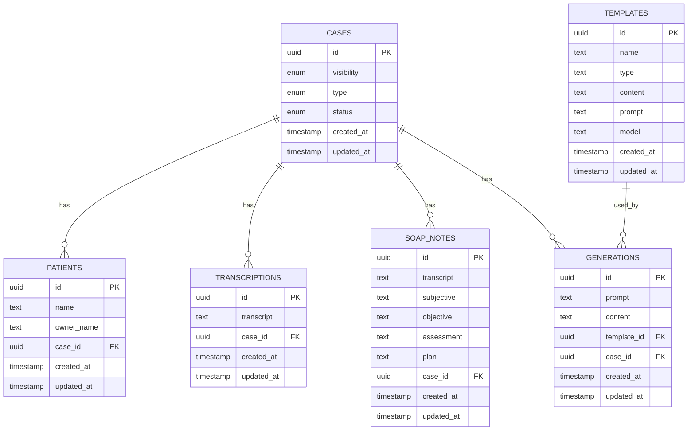

# Database Schema Documentation: Veterinary Clinic Management System

## Overview

This document provides comprehensive information about the Supabase PostgreSQL database schema that powers our veterinary clinic management system. The database is designed to track patient cases, generate clinical documentation, and manage templates for AI-assisted content generation.

## How to Keep This Document Updated

When making changes to the database schema:

1. Update the SQL definitions in this document
2. Regenerate the entity relationship diagram if needed
3. Update the TypeScript examples to reflect the new schema
4. Run `npm run codegen:local` to update TypeScript types
5. Document any migration steps in the Schema Evolution section

## Core Entities and Relationships



## Database Schema SQL Definitions

```sql
create table public.cases (
  id uuid not null default gen_random_uuid (),
  visibility public.CaseVisibility null,
  type public.CaseType null,
  status public.CaseStatus null,
  created_at timestamp with time zone null,
  updated_at timestamp with time zone null,
  constraint cases_pkey primary key (id),
  constraint cases_id_key unique (id)
) TABLESPACE pg_default;

create table public.generations (
  id uuid not null default gen_random_uuid (),
  created_at timestamp with time zone not null default now(),
  updated_at timestamp with time zone null default now(),
  prompt text null,
  content text null,
  template_id uuid null,
  case_id uuid null,
  constraint generations_pkey primary key (id),
  constraint generations_case_id_fkey foreign KEY (case_id) references cases (id) on update CASCADE on delete CASCADE,
  constraint generations_template_id_fkey foreign KEY (template_id) references templates (id) on update CASCADE on delete CASCADE
) TABLESPACE pg_default;

create table public.patients (
  name text null,
  owner_name text null,
  created_at timestamp with time zone not null default now(),
  updated_at timestamp with time zone null default now(),
  case_id uuid null,
  id uuid not null default gen_random_uuid (),
  constraint patients_pkey primary key (id),
  constraint patients_id_key unique (id),
  constraint patient_case_id_fkey foreign KEY (case_id) references cases (id) on update CASCADE on delete CASCADE
) TABLESPACE pg_default;

create table public.soap_notes (
  id uuid not null default gen_random_uuid (),
  created_at timestamp with time zone not null default now(),
  updated_at timestamp with time zone null default now(),
  transcript text null,
  subjective text null,
  objective text null,
  assessment text null,
  plan text null,
  case_id uuid null,
  constraint soap_notes_pkey primary key (id),
  constraint soap_notes_id_key unique (id),
  constraint soap_notes_case_id_fkey foreign KEY (case_id) references cases (id) on update CASCADE on delete CASCADE
) TABLESPACE pg_default;

create table public.templates (
  id uuid not null default gen_random_uuid (),
  name text null,
  type text null,
  content text null,
  created_at timestamp with time zone null default now(),
  updated_at timestamp with time zone null default now(),
  prompt text null,
  model text null,
  constraint templates_pkey primary key (id)
) TABLESPACE pg_default;

create table public.transcriptions (
  transcript text null,
  created_at timestamp with time zone not null default now(),
  updated_at timestamp with time zone null default now(),
  case_id uuid null,
  id uuid not null default gen_random_uuid (),
  constraint transcriptions_pkey primary key (id),
  constraint transcriptions_id_key unique (id),
  constraint transcriptions_case_id_fkey foreign KEY (case_id) references cases (id)
) TABLESPACE pg_default;
```

## Enum Definitions

```sql
-- Add these definitions if not already present
CREATE TYPE public."CaseVisibility" AS ENUM ('public', 'private');
CREATE TYPE public."CaseType" AS ENUM ('checkup', 'emergency', 'surgery', 'follow_up');
CREATE TYPE public."CaseStatus" AS ENUM ('reviewed', 'ongoing', 'completed');
```

## Entity Details

### Cases
The central entity that represents a veterinary case or appointment.

- **Primary Key**: `id` (UUID)
- **Enums**:
  - `visibility`: `public` or `private`
  - `type`: `checkup`, `emergency`, `surgery`, or `follow_up`
  - `status`: `reviewed`, `ongoing`, or `completed`
- **Timestamps**: `created_at`, `updated_at`

### Patients
Represents animal patients with their basic information.

- **Primary Key**: `id` (UUID)
- **Fields**:
  - `name`: Patient (animal) name
  - `owner_name`: Name of the pet owner
- **Relationships**: Each patient belongs to a single case (`case_id` foreign key)
- **Timestamps**: `created_at`, `updated_at`

### Transcriptions
Stores raw transcripts from veterinary consultations.

- **Primary Key**: `id` (UUID)
- **Fields**:
  - `transcript`: The full text transcript
- **Relationships**: Each transcription belongs to a case (`case_id` foreign key)
- **Timestamps**: `created_at`, `updated_at`

### SOAP Notes
Structured clinical documentation following the SOAP format (Subjective, Objective, Assessment, Plan).

- **Primary Key**: `id` (UUID)
- **Fields**:
  - `transcript`: Raw transcript that was used to generate the SOAP note
  - `subjective`: Patient history and symptoms as reported
  - `objective`: Clinical findings and observations
  - `assessment`: Diagnosis and clinical reasoning
  - `plan`: Treatment plan and follow-up instructions
- **Relationships**: Each SOAP note belongs to a case (`case_id` foreign key)
- **Timestamps**: `created_at`, `updated_at`

### Templates
Reusable templates for AI-assisted content generation.

- **Primary Key**: `id` (UUID)
- **Fields**:
  - `name`: Template name
  - `type`: Template category or type
  - `content`: Template content
  - `prompt`: AI prompt instructions
  - `model`: AI model to use
- **Timestamps**: `created_at`, `updated_at`

### Generations
AI-generated content based on templates and case data.

- **Primary Key**: `id` (UUID)
- **Fields**:
  - `prompt`: The prompt used for generation
  - `content`: The generated content
- **Relationships**:
  - Belongs to a case (`case_id` foreign key)
  - Based on a template (`template_id` foreign key)
- **Timestamps**: `created_at`, `updated_at`

## Key Constraints and Cascades

- All tables use UUIDs as primary keys with `gen_random_uuid()` as the default generator
- Foreign key relationships to `cases` table have `ON UPDATE CASCADE` and `ON DELETE CASCADE` constraints
- This means when a case is deleted, all related records (patients, transcriptions, SOAP notes, generations) are automatically deleted

## Type Generation and Usage

The database schema is used to generate TypeScript types via the Supabase CLI:

1. Types are generated using `npm run codegen:local` or `npm run codegen`
2. Generated types are stored in `database.types.ts` in the project root
3. These types are used throughout the application to ensure type safety when interacting with the database

Example of running the type generation:
```bash
npm run codegen:local
```

## TypeScript Type Examples

```typescript
// Example of the generated types (partial)
export type Database = {
  public: {
    Tables: {
      cases: {
        Row: {
          id: string
          visibility: Database["public"]["Enums"]["CaseVisibility"] | null
          type: Database["public"]["Enums"]["CaseType"] | null
          status: Database["public"]["Enums"]["CaseStatus"] | null
          created_at: string | null
          updated_at: string | null
        }
        Insert: {
          id?: string
          visibility?: Database["public"]["Enums"]["CaseVisibility"] | null
          type?: Database["public"]["Enums"]["CaseType"] | null
          status?: Database["public"]["Enums"]["CaseStatus"] | null
          created_at?: string | null
          updated_at?: string | null
        }
        Update: {
          id?: string
          visibility?: Database["public"]["Enums"]["CaseVisibility"] | null
          type?: Database["public"]["Enums"]["CaseType"] | null
          status?: Database["public"]["Enums"]["CaseStatus"] | null
          created_at?: string | null
          updated_at?: string | null
        }
      }
      // Other tables follow the same pattern
    }
    Enums: {
      CaseVisibility: "public" | "private"
      CaseType: "checkup" | "emergency" | "surgery" | "follow_up"
      CaseStatus: "reviewed" | "ongoing" | "completed"
    }
  }
}
```

## Server Actions

The application uses Next.js server actions organized by domain to interact with the database:

- `/app/actions/cases/actions.ts` - Case management
- `/app/actions/appointments/actions.ts` - Appointment handling
- `/app/actions/generations/actions.ts` - AI content generation
- `/app/actions/soap-notes/actions.ts` - SOAP notes management
- `/app/actions/transcriptions/actions.ts` - Transcription management
- `/app/actions/templates/actions.ts` - Template management

## Common Database Operations

### Querying Cases with Related Data

```typescript
const query = supabase
  .from("cases")
  .select(`
    id,
    visibility,
    type,
    status,
    created_at,
    updated_at,
    patients (
      id,
      name,
      owner_name
    ),
    transcriptions (
      id
    ),
    soap_notes (
      id
    ),
    generations (
      id
    )
  `)
  .order("created_at", { ascending: false });
```

### Creating a New Case

```typescript
const { data, error } = await supabase
  .from("cases")
  .insert({
    visibility: "private",
    type: "checkup",
    status: "ongoing",
  })
  .select()
  .single();
```

### Adding a Patient to a Case

```typescript
const { data, error } = await supabase
  .from("patients")
  .insert({
    name: "Fluffy",
    owner_name: "John Smith",
    case_id: caseId
  })
  .select()
  .single();
```

### Creating a SOAP Note

```typescript
const { data, error } = await supabase
  .from("soap_notes")
  .insert({
    case_id: caseId,
    transcript: transcriptText,
    subjective: "Patient presented with...",
    objective: "On examination...",
    assessment: "Diagnosis is...",
    plan: "Treatment plan includes..."
  })
  .select()
  .single();
```

### Generating Content from a Template

```typescript
const { data, error } = await supabase
  .from("generations")
  .insert({
    case_id: caseId,
    template_id: templateId,
    prompt: "Generate a discharge summary for...",
    content: generatedContent
  })
  .select()
  .single();
```

## Troubleshooting

### Common Issues

1. **Missing Foreign Keys**: Ensure case_id exists before creating related records
2. **Enum Validation Errors**: Use only valid enum values for `visibility`, `type`, and `status`
3. **Type Mismatches**: Use the generated TypeScript types to ensure correct data types
4. **Null Constraints**: Some fields are nullable while others require values

### Debugging

The application includes a debug utility to list all cases:

```typescript
import { debugListAllCases } from "@/app/actions";

// Usage
const cases = await debugListAllCases();
console.log(cases);
```

## Best Practices

1. **Always use transactions** when creating related records to ensure data consistency
2. **Use the generated TypeScript types** to ensure type safety
3. **Include error handling** for all database operations
4. **Use server actions** for database operations rather than client-side code
5. **Keep timestamps updated** when modifying records

## Schema Evolution

When modifying the database schema:

1. Create a new migration file in `supabase/migrations/`
2. Run the migration locally for testing
3. Regenerate TypeScript types with `npm run codegen:local`
4. Update affected server actions and components
5. Test thoroughly before deploying
6. **Update this documentation** with the new schema details

### Migration History

| Date | Migration | Description |
|------|-----------|-------------|
| 2025-04-26 | 20250426040729_initial.sql | Initial schema creation |
| | | |

## Additional Resources

- [Supabase Documentation](https://supabase.com/docs)
- [Next.js Server Actions](https://nextjs.org/docs/app/building-your-application/data-fetching/server-actions)
- Project README at `/README.md` for overall architecture
- Run `npm run codegen:local` to update TypeScript types after schema changes